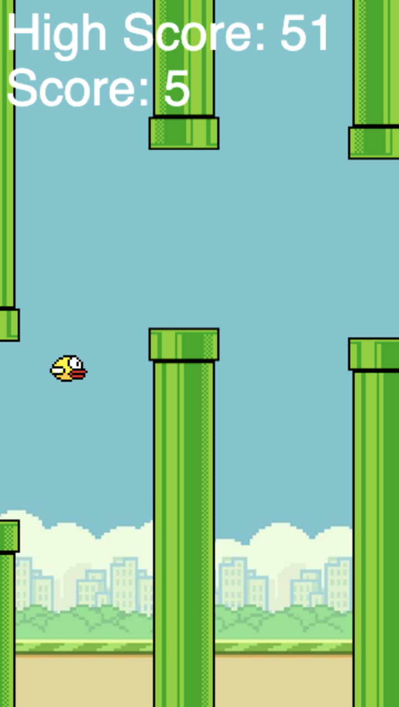

# Flappy Bird Clone

This was made following this tutorial: [Create Flappy Bird clone in Javascript HTML CSS](https://www.youtube.com/watch?v=jj5ADM2uywg)

I have always loved video games, so of course Flappy Bird is a classic for me. Since I am already familiar with HTML, CSS, and JS, I thought following this tutorial would be a good start. I plan to use what I learned from this experience in future projects.

After completing the tutorial, I decided to add some additional features. This included animated wings, high score, mouse click to jump, and touch to jump (for touchscreens). I used what I learned from the tutorial to implement these changes, with some help from the internet. My biggest issue was with using touchstart. When I implemented it in the same way as key pushes and mouse clicks, it would cause the bird to jump twice. This took a while for me to figure out. I used log messages to find out that the bird jumped twice because every touchscreen interaction triggered a touch event and a mouse event. After some research, I realized that at the end of a touch (touchend event), a click event will be automatically triggered. I fixed this by adding a listener for touchend and then preventing that event's default behavior. Now, this game works on both desktop and mobile devices!
